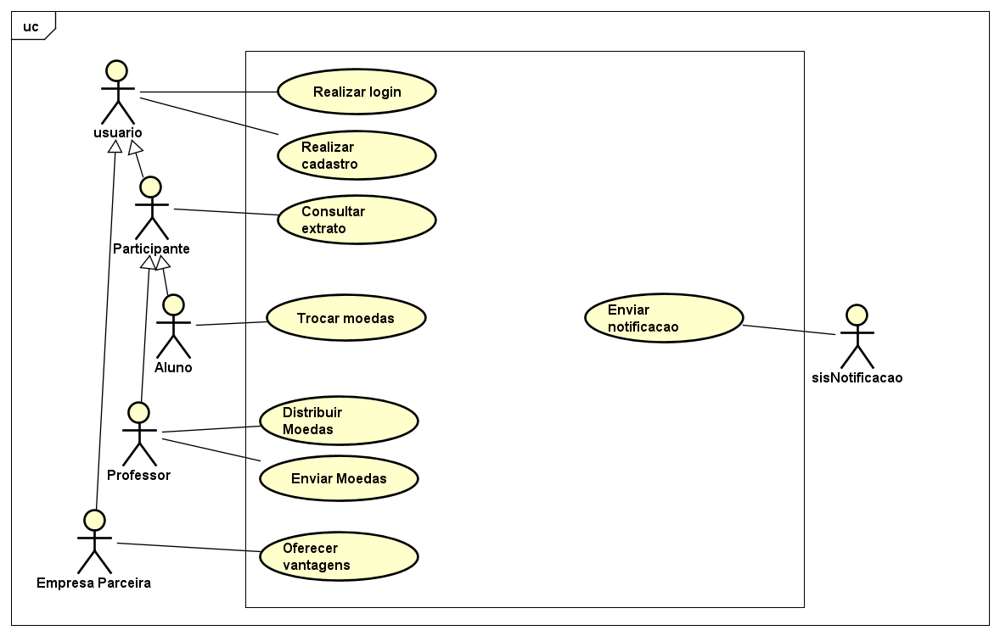

# Sistema de Moedas - SmartCoins
O SmartCoins é um sistema que visa reconhecer e incentivar o mérito acadêmico dos alunos através de uma moeda virtual. Professores podem distribuir moedas a alunos como forma de reconhecimento por bom comportamento e participação, e os alunos podem trocar essas moedas por vantagens oferecidas por empresas parceiras.

O sistema está sendo desenvolvido como parte da disciplina de Laboratório de Desenvolvimento de Software, lecionado pelo professor [João Paulo Aramuni](https://github.com/joaopauloaramuni/joaopauloaramuni) do curso de Engenharia de Software da PUC Minas.

### Participantes
* [Ana Julia Teixeira Candido](https://github.com/anajuliateixeiracandido)
* [Marcella Ferreira Chaves Costa](https://github.com/marcellafccosta)
* [Sophia Mendes Rabelo ](https://github.com/sophiaamr)

### Tecnologias Utilizadas
Este projeto foi desenvolvido utilizando uma combinação de tecnologias modernas que garantem um sistema eficiente, escalável e responsivo. As principais tecnologias empregadas são:
* Node.js
* ReactJS
* PostgreSQL

## Diagramas

### Diagrama de Caso de Uso

 

### Diagrama de Classe

 

### Diagrama de Componentes

 

